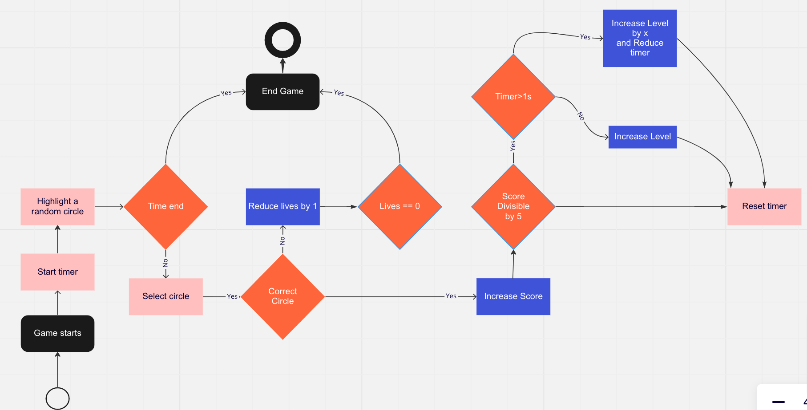
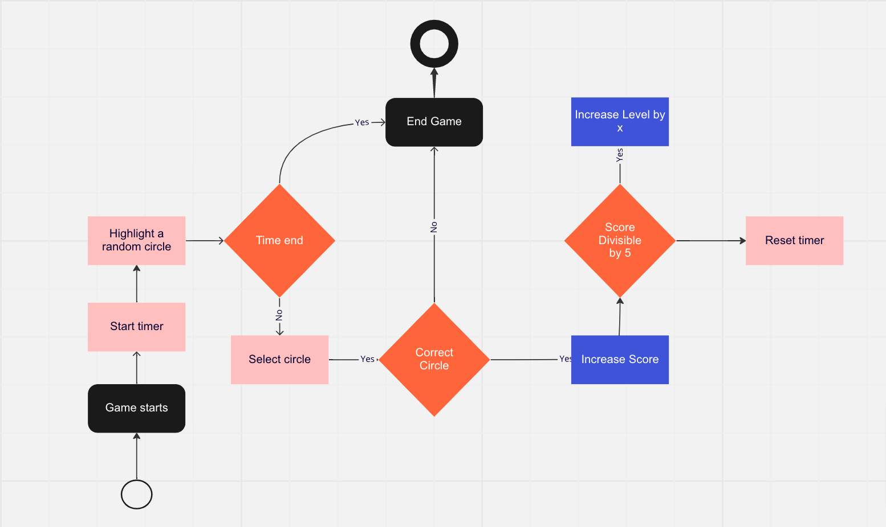

# Speed Game - React Frontend Project

## Instructions

How the game works:

- When the game starts, the circles are rendered and one circle is randomly selected as the target.
- The player has to click on the target as fast as possible.
- Timer starts counting down from 10s seconds
- When the selected circle is clicked, the score is updated and a new target is selected.
- If the wrong circle is clicked, lives is reduced by 1
- If the lives is 0, the game is over and the score is displayed.
- if score is any number divisible by 5, the level is increased by 1 and or the timer is reduced by 2 seconds.

- Note: you can have different levels with different timers, lives and number of circles.

### General

Fork this repo, then clone the **fork** to your machine and start working on it. You can open a pull request as soon as possible (no need to wait until finished)
For styling, you can use whatever css solution you want: css, scss, Material UI, etc.

### Step 1

- Create a game slice with some or all the following actions:
  - `startGame`
  - `endGame`
  - `increaseScore`
  - `decreaseLives`
  - `increaseLevel`
  - `decreaseTimer`
- and the following state:
  - `score`: the current score
  - `isRunning`: whether the game is running or not
  - `startTime`: the time when the game started
  - `endTime`: the time when the game ended
  - `level`: the current level
  - `speed`: the current speed of the game

### Step 2

- Create a `Game` component that renders the following:
  - a `button` that starts the game
  - a `button` that stops the game
  - a `button` that resets the game
  - a `div` that shows the current score
  - a `div` that shows the current level
  - Circles representing the current level

### Step 3

- Create a `Circle` component that renders a circle with the following properties:

  - `size`: the size of the circle
  - `color`: the color of the circle
  - `onClick`: a function that is called when the circle is clicked
  - `isTarget`: a boolean that determines whether the circle is the target or not

- Render all the circles in the `Game` component

- Circles represent the current level. For example, if the level is 1, there should be 1 circle, if the level is 2, there should be 2 circles, etc.

### Step 4

- Create a `Timer` component that renders a timer with the following properties:
  - `time`: the time to count down from
  - `onTimeEnd`: a function that is called when the timer ends

### Step 5

- use `use-sound` to play a sound when the game starts, stops, and when the user clicks on a circle
- use `react-spring` to animate the circles when they are clicked or when the game starts or stops.

Take your time to implement the following features:

- Add a timer that shows how much time is left
- Add a button that changes the level manually
- Give dynamic points for clicking on the target depending on the level and the time left
- Add a button that changes the color of the circles - game theme
- Implement two player mode
- improve the game to make it more fun
- Add more features if you want to

## References

1. Reference 1:
   

2. Reference 2:
   

3. [Online reference](https://miro.com/app/board/uXjVPDjtQ1k=/)
